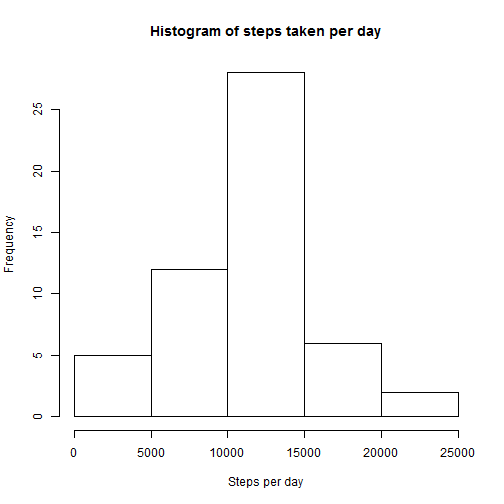
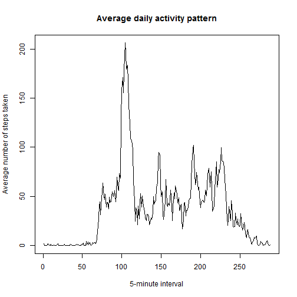
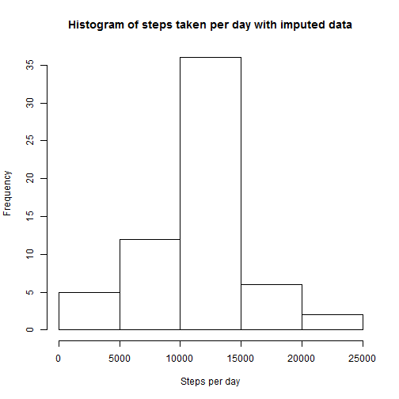
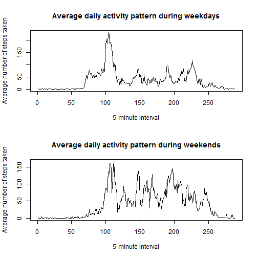

***
####Loading and preprocessing the data (includes converting strings to dates)


```r
Activity<-read.csv("activity.csv", header=TRUE, stringsAsFactors=FALSE)
```

```
## Warning: cannot open file 'activity.csv': No such file or directory
```

```
## Error: cannot open the connection
```

```r
Activity$date<-as.Date(Activity$date,"%Y-%m-%d")
```

***
####What is the mean total number of steps taken per day?

First, I am making a histogram of the total number of steps taken per day across the dates.


```r
Stepsperday<-tapply(Activity$steps, Activity$date, sum) 
hist(Stepsperday, main="Histogram of steps taken per day", xlab="Steps per day", ylab="Frequency") 
```

 

Next, I'm calculating and reporting the mean and median total number of steps taken per day.


```r
mean_Stepsperday<-mean(Stepsperday, na.rm=TRUE)
mean_Stepsperday
```

```
## [1] 10766
```

```r
median_Stepsperday<-median(Stepsperday, na.rm=TRUE)
median_Stepsperday
```

```
## [1] 10765
```

The mean steps per day is 10766, whereas the median steps per day is 10765.

***
####What is the average daily activity pattern?

I'm making a time series plot of the 5-minute interval (x-axis) and the average number of steps taken, averaged across all days (y-axis)

```r
Stepsperinterval<-tapply(Activity$steps, Activity$interval, mean, na.rm=TRUE)
plot(Stepsperinterval, type="l", main="Average daily activity pattern", xlab="5-minute interval", ylab="Average number of steps taken")
```

 

From the plot it looks like the 110th interval contains the maximum number of steps, but it's a bit hard to tell. 


```r
which.max(Stepsperinterval)
```

```
## 835 
## 104
```
The interval with the maximum numbers of steps is the 104th interval, that is, 8:35.

***
####Imputing missing values

First, I'm calculating and reporting the total number of missing values in the dataset

```r
sum(!complete.cases(Activity))
```

```
## [1] 2304
```
There are 2304 missing values to replace.

Next I'm filling in all the missing values of the dataset using the mean for that interval. I'm creating a new dataset, Activity2, which is equal to the original but with the missing data filled in by looping through interval values.


```r
Activity2<-Activity
Missing_index<-is.na(Activity2$steps)
interval<-seq(from = 0, to=2355, by=5)
for(i in interval){
  Activity2$steps[Missing_index][Activity2$interval==i] = mean(Activity2$steps[Activity2$interval==i], na.rm=TRUE)
}
```
      

I'm making a histogram of the total numbers of steps taken each day

```r
Stepsperday2<-tapply(Activity2$steps, Activity2$date, sum) 
hist(Stepsperday2, main="Histogram of steps taken per day with imputed data", xlab="Steps per day", ylab="Frequency") 
```

 

Here is the mean and median total number of steps taken per day after mean replacement based on interval.


```r
mean_Stepsperday2<-mean(Stepsperday2, na.rm=TRUE)
mean_Stepsperday2
```

```
## [1] 10766
```

```r
median_Stepsperday2<-median(Stepsperday2, na.rm=TRUE)
median_Stepsperday2
```

```
## [1] 10766
```
These values are extremely similar to the values without mean imputation. The mean is still 10766 steps per day. The median increased by one step per day, from 10765 to 10766. So, the median is now equivalent to the mean steps per day.

***
####Are there differences in activity patterns between weekdays and weekends?
I'm first creating a new factor variable in the dataset with two levels (weekday or weekend)

```r
Weekday<-weekdays(Activity2$date)
Activity3<-cbind(Activity2, Weekday, stringsAsFactors=FALSE)
Activity3$Weekday[Activity3$Weekday=="Monday"] <- "Weekday"
Activity3$Weekday[Activity3$Weekday=="Tuesday"] <- "Weekday"
Activity3$Weekday[Activity3$Weekday=="Wednesday"] <- "Weekday"
Activity3$Weekday[Activity3$Weekday=="Thursday"] <- "Weekday"
Activity3$Weekday[Activity3$Weekday=="Friday"] <- "Weekday"
Activity3$Weekday[Activity3$Weekday=="Saturday"] <- "Weekend"
Activity3$Weekday[Activity3$Weekday=="Sunday"] <- "Weekend"
Activity3$Weekday=as.factor(Activity3$Weekday)
```

I'm making a panel plot containing a time series plot of the 5-minute interval (x-axis) and the average number of steps taken, averaged across all weekday days or weekend days (y-axis)

```r
Stepsperintervalweekday<-tapply(Activity3$steps[Activity3$Weekday=="Weekday"], Activity3$interval[Activity3$Weekday=="Weekday"], mean, na.rm=TRUE)
Stepsperintervalweekend<-tapply(Activity3$steps[Activity3$Weekday=="Weekend"], Activity3$interval[Activity3$Weekday=="Weekend"], mean, na.rm=TRUE)
par(mfrow=c(2,1))
plot(Stepsperintervalweekday, type="l", main="Average daily activity pattern during weekdays", xlab="5-minute interval", ylab="Average number of steps taken")
plot(Stepsperintervalweekend, type="l", main="Average daily activity pattern during weekends", xlab="5-minute interval", ylab="Average number of steps taken")
```

 
